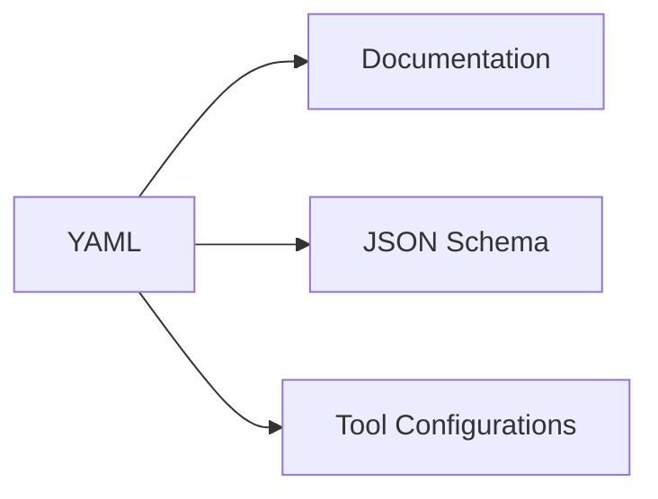

# Format of SXL YAML Files
An RSMP SXL (Signal Exchange List) defines the messages that can be exchanged with a specific type of equipment, e.g. traffic light controllers.

Specifically, the SXL defines the alarms, statuses and commands and their attributes.

The SXL is the authoritative source for an SXL, and is used to generate documentation as well as JSON schema for automatic validation of message structure.
It's also used to generate configuratiosn for tools that cannot yert directly read the YAML format.




## Structure
An SXL YAML contains a meta section, and a definition of the objects types included in the SXL:

```
meta: Information about the SXL
objects: Definitions of objects types
  Traffic Light Controller:
    ...
  Signal group:
    ...
  Detector logic
    ...
```

### Meta Section
Includes descriptions of the SXL, like the name and version.

```
meta:
  name: Name of the schema
  description: Description of the schema
  version: Version of the schema
```

### Objects Section
Contains definitions of each object type in the SXL.
For each object type, there's a description, as well as definition of alarms, statuses and commands:
 
```
objects:
  Signal Group:
    description: Description of the object
    aggregated_status: Aggregated status definitions
      ...
    functional_position: Definition of functional position
    functional_state: Definition of functional state
    alarms: Alarm definitions
      ...
    statuses: Status definitions
      ...
    commands: Command definitions
      ...
  ...
```
### Aggregated Status Section
For each object type, the `aggregated_status:` section defines meaning of status bits 1-8:

```
  aggregated_status:
    1:
      title: Name of status bit
      description: Description of status bit
    ...
    8:
      title: Name of status bit
      description: Description of status bit
```

### Functional Position and State 
For each object type, the `functional_position:` and `functional_state:` define possible values.
If not used, `null` is specified.

```
    functional_position: List of possible values, or null if not used
    functional_state: List of possible values, or null if not used
```

### Alarms Sections
For each object type, the `alarms:` section defines the alarms that can be send by that type of object.
The allowed alarm priorities and categories are defined in RSMP Core.

```
  A0001: Definition of alarm 1
    description: Description of the alarm
    priority: The alarm priority, either 1, 2 or 3
    category: The alarm categery, either D or T
```

### Statuses Sections
For each object type, the `statuses:` section defines the alarms that can be send by that type of object.

```
  S0001: Definition of status 1
    description: Description of the status
    arguments: Definition of status arguments
      ...
```

Each argument contains a required description and a type. In addition it might contain other optional attributes that define
or restict how the argument is used.

```
    arguments:
      speed:
        description: Description of argument
        type: Type of argument
        ...
      ...
```

### Commands Sections
For each object type, the `commands:` section defines the alarms that can be send to that type of object.
In addition it might contain other options used for validating the argument value.

```
  M001: Definition of command 1
    description: Description of the command
    arguments: Definition of command arguments
      ...
```

Each argument contains a required description and a type.
In addition it might contain other options used for validating the argument value.

```
    arguments:
      speed:
        description: Description of argument
        type: Type of argument
        ...
      ...
```

### Argument options
Status and command argument definition might include options describing which values are valid for that argument.
These option can also be used for validating messages, e.g. by generating a JSON Schema.

#### description (Required)
A description of the argument

#### type (Required)
The type allowed for the argument. Possible values:

- string, a string, e.g. "start"
- integer: an integer send as a string, e.g. "6"
- boolean: a boolean send as a string, ether "true" or "false"
- base64: binary data encoded in base 64 format
- timestamp: a timestamp in the format "2025-06-08T08:05:06.584Z
- version: a semantic version string in the format "4.2.5"
- message_id: a message id in the format "be12ab9a-800c-4c19-8c50-adf832f22420"
- component_id: a string without further retrictions, e.g. "O+14439=481WA001"
- command_code: a command code in the format "M0001"
- status_code: a status code in the format "S0001"
- alarm_code: an alarm code in the format "A0001"
- string_list: a string with a command-separted list of items, e.g. "red,green,blue"
- integer_list: a string wih a comma-separated list of integers, e.g. "1,2,3"
- boolean_list: a string with a comma-separated list of booelans, e.g. "true,true,false"

#### values
A list of allowed enum values, defines as a hash of value/description.
The values can be either strings or integers:

Example:
```yaml
   values:
     new: New priority request
     update: Update to existing priority request
     cancel: Cancel an existing priority
```

#### min
Minimum value specified as an integer, e.g. 1.
Only allowed if the type is `integer`.

#### max
Maximum value specified as an integer, e.g. 255.
Only allowed if the type is `integer`.

#### pattern
A regular expression (regex) pattern used to validate the raw argument string, specified as a string, e.g. "^[01]*$".
Allowed regardless of the argument type.

## Example Structure
Here is an example structure of an SXL YAML file:

```yaml
meta:
  name: tlc
  description: Traffic Light Controllers
  version: 1.0.15
objects:
  Traffic Light Controller:
    description: SXL for Traffic Light Controllers
    aggregated_status:
      1:
        title: Local mode
        description: Traffic Light Controller is in local mode
      ...
      8:
        title: Not Connected
    functional_position: null
    functional_state: null
    alarms:
      A0001:
        description: Serious hardware error
        priority: 2
        category: D
      ...
    statuses:
      S0001:
        description: Signal group status
        arguments:
          cyclecounter:
            description: Cycle counter
            type: integer
            min: 0
            max: 999
          ...
      ...
    commands:
      M0002:
        description: Set current time plan
        arguments:
          timeplan:
            description: Time plan number
            type: integer
            min: 1
            max: 255
          ...
      ...
```
